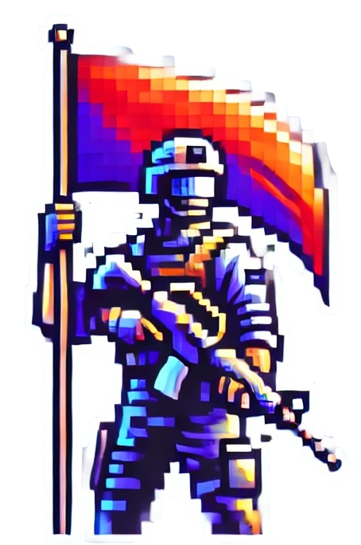

<h1>
  
  SID Laboratory 1: Agents in Capture the Flag
</h1>

## Description
This project is part of the university subject  *Sistemes Intel·ligents Distribuïts* (SID), focused on building intelligent agents to compete in a **Capture The Flag** game using the `pyGOMAS` simulation platform.
+ Agents are developed using AgentSpeak and run on the SPADE platform.
+ They follow a Belief-Desire-Intention (BDI) model to reason and act logically.

## Game Enviroment
In [pyGOMAS](https://github.com/javipalanca/pygomas) the classic Capture the Flag game takes place in a World War II setting, where two opposing factions—the Allies and the Axis—compete for control of a single flag.

+ The **attacking team** must infiltrate enemy lines and capture the flag before the timer runs out.
+ The **defending team** must prevent the attackers from succeeding.

### Agents
Each agent is designed to perceive the environment, make rational decisions, and act accordingly to achieve their team's objective. The three available roles are:

- **FieldOps 🎖**: Supplies **ammunition pack** to keep allies equipped.
- **Soldier 🪖**: Specializes in combat, dealing **double damage** with weapons.
- **Medic 🏥**: Creates **healing packs** that restore health to teammates.

## Implementation Details
---

## Contributors
- Òscar Molina
- Llum Fuster-Palà
- Javier Puerta
- Júlia Orteu
